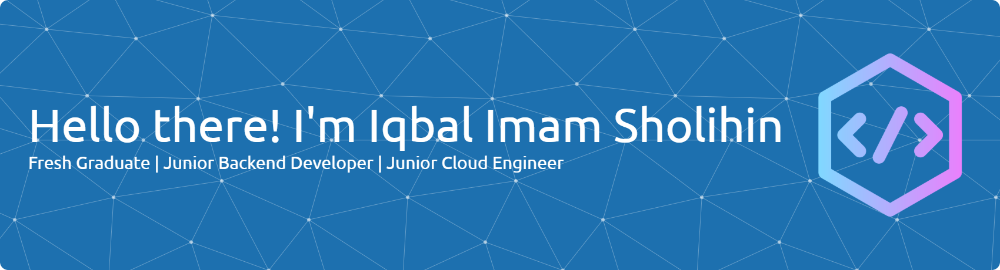

<!-- - 🌱 I’m currently learning **AWS Cloud Computing** at **Orbit Future Academy**

##### Skills -->

#### 💫 About Me:

🌱 I’m currently learning **AWS Cloud Computing** at **Orbit Future Academy**

#### 🌐 Socials:

  

#### 💻 Tech Stack:

                 

#### 📊 GitHub Stats:

 
 

#### 🏆 GitHub Trophies

---

<!-- Proudly created with GPRM ( https://gprm.itsvg.in ) -->

<h4 align="left">Let's Play the Game</h4>

###

<picture>
  <source media="(prefers-color-scheme: dark)" srcset="https://raw.githubusercontent.com/iqbalimams/iqbalimams/output/pacman-contribution-graph-dark.svg">
  <source media="(prefers-color-scheme: light)" srcset="https://raw.githubusercontent.com/iqbalimams/iqbalimams/output/pacman-contribution-graph.svg">
  
</picture>

###
